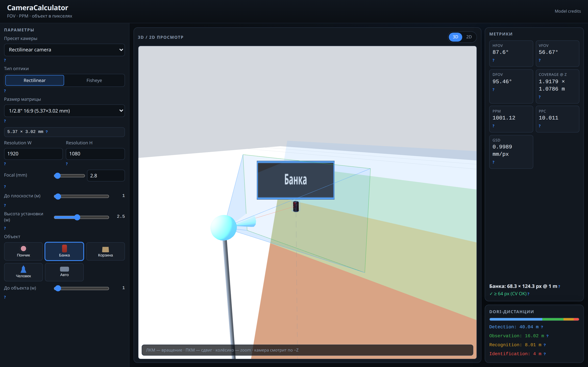

# CameraCalculator



CameraCalculator is a FastAPI web application for exploring CCTV lens geometry,
field of view, scene coverage, pixel density, GSD, DORI thresholds, and the
projected size of reference objects. The interface is currently in Russian.

It supports an exact ideal rectilinear pinhole model and an equidistant fisheye
model (`r = fθ`). Results describe those ideal models; a camera datasheet's
measured field of view must not be treated as an exact pinhole measurement.

## Quick start

From this directory:

```bash
docker compose up -d --build
docker compose ps
```

Open:

- UI: <http://localhost:8088>
- health check: <http://localhost:8088/health>
- OpenAPI UI: <http://localhost:8088/docs>

Stop the stack with:

```bash
docker compose down
```

Run the complete Docker test suite, including browser tests against the live
application:

```bash
./scripts/ci.sh
```

## Local development with uv

Python 3.12 or newer and [uv](https://docs.astral.sh/uv/) are required.

```bash
uv sync --frozen --all-extras
uv run uvicorn cctv_lens_calc.api.main:app --reload --port 8000
```

Run linting and the fast test suite:

```bash
uv run ruff check .
uv run pytest -m 'not ui'
```

The UI tests need a live server. Keep the Uvicorn command above running in one
terminal, then run:

```bash
uv run playwright install chromium
BASE_URL=http://127.0.0.1:8000 uv run pytest -m ui
```

## Model and metric boundaries

For a rectilinear lens, the calculator uses exact ideal pinhole equations:

```text
FOV = 2 atan(sensor_size / (2 focal_length))
coverage = 2 distance tan(FOV / 2)
```

This is a mathematical camera model, not a claim that a manufacturer's measured
datasheet FOV exactly follows the ideal pinhole equation. Real lenses can differ
because of distortion, active image area, focus distance, cropping, and
manufacturer measurement methods.

Fisheye projection is equidistant: image radius is proportional to ray angle,
`r = fθ`. Forward-plane coverage is finite only when the relevant FOV is below
180°. At 180° the edge ray is parallel to the forward plane; above 180° it points
behind that plane. Consequently, frame-average density, GSD, and coverage-derived
DORI results are unavailable when HFOV is 180° or greater.

DORI uses the EN 62676-4 horizontal density thresholds: detection 25 px/m,
observation 62.5 px/m, recognition 125 px/m, and identification 250 px/m.
Density and DORI are frame-average planning values, not local guarantees for a
distorted lens.

The 2D fisheye GLB silhouette is schematic. It helps explain placement but does
not define projected object dimensions. The bounding box returned by
`POST /api/calculate` is authoritative.

## API

The application exposes:

- `GET /health` — liveness and readiness checks
- `POST /api/calculate` — FOV, coverage, density, DORI, and object projection
- `GET /api/presets/sensors` — sensor presets
- `GET /api/presets/cameras` — camera presets and expanded parameters
- `GET /api/presets/objects` — reference objects
- `GET /api/presets/cv_thresholds` — CV pixel thresholds

Use either `camera.sensor_format_id` or explicit `sensor_width_mm` and
`sensor_height_mm` values. Interactive schemas and request examples are
available at `/docs`.

## Project navigation

- `src/cctv_lens_calc/domain/` — projection math, DORI, presets, and API models
- `src/cctv_lens_calc/api/` — FastAPI application and routes
- `src/cctv_lens_calc/web/static/` — HTML, CSS, JavaScript, and Three.js UI
- `models/` — bundled GLB assets; see [the model map](models/README.md)
- `tests/` — unit, property, regression, API, and Playwright tests
- `Dockerfile` and `docker-compose.yml` — runtime and test containers
- `scripts/ci.sh` — reproducible full-suite entry point

Configuration lives at these exact paths:

- `src/cctv_lens_calc/domain/presets.py` — sensor and camera presets, CV thresholds
- `src/cctv_lens_calc/domain/reference_objects.py` — physical dimensions,
  projection offsets, and visual scale
- `src/cctv_lens_calc/web/static/index.html` — UI structure
- `src/cctv_lens_calc/web/static/css/style.css` — UI layout and theme
- `tests/conftest.py` — live-server `BASE_URL` default
- `pyproject.toml` — package, test, and Ruff configuration
- `docker-compose.yml` — port mapping, health check, and test profile

Keep metric calculations in the backend; the UI consumes `/api/calculate`.

## Contributing and licensing

See [CONTRIBUTING.md](CONTRIBUTING.md) for the development workflow and
[SECURITY.md](SECURITY.md) for private vulnerability reporting.

CameraCalculator source code is available under the [MIT License](LICENSE).
Bundled libraries and 3D assets retain their own terms; see
[THIRD_PARTY_NOTICES.md](THIRD_PARTY_NOTICES.md).
